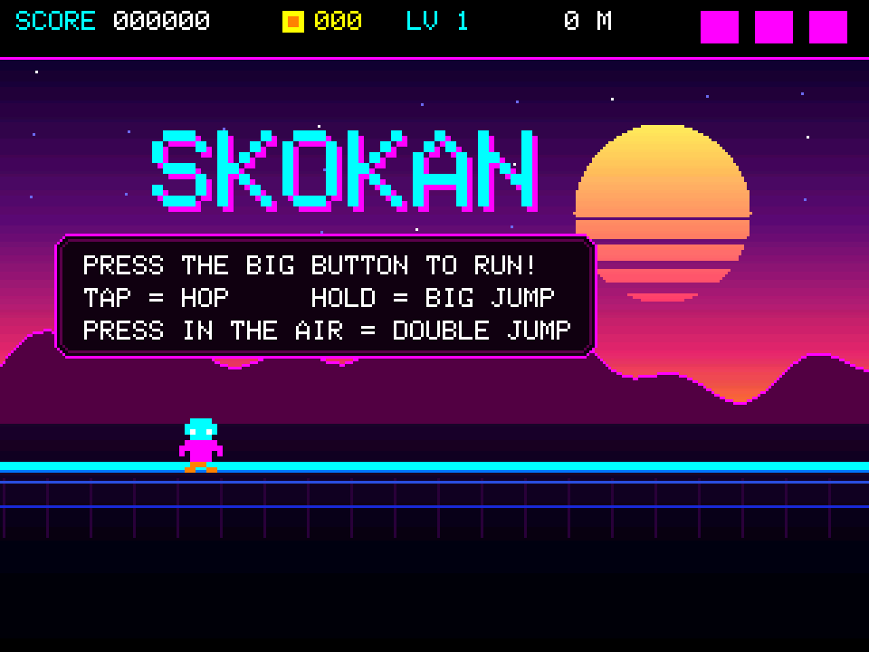
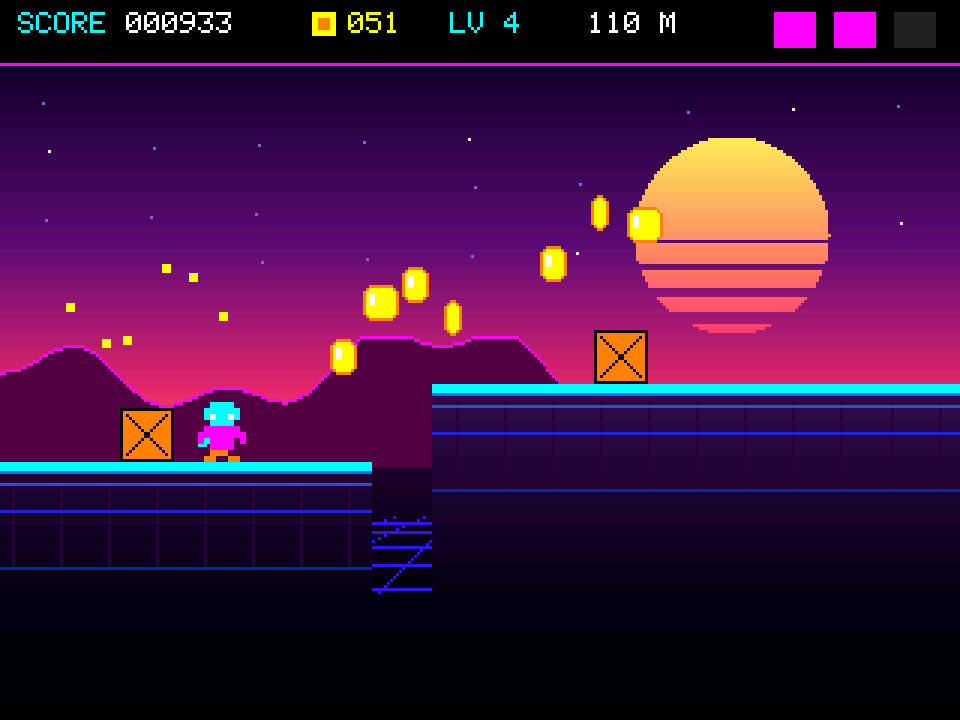

# mluvitko / SKOKAN

**[▶ Play SKOKAN in your browser](https://letalvoj.github.io/skokan/)** — the
same C++ as the box, compiled to WebAssembly.

A talking box built on an ESP32-S3 together with an 8-year-old co-designer, and
**SKOKAN** (Czech for *jumper*), the one-button neon platform runner that ended
up living on it.

The same `src/game.cpp` runs three ways: on the ESP32's 320×240 SPI panel, as a
native macOS app, and in a browser. Only the screen, clock, button and audio are
swapped underneath — see [host/](host/README.md).

```bash
make play    # native macOS app
make web     # WebAssembly build
make stats   # bot rollouts: per-level difficulty table
make check   # fairness contract: no unclearable levels
make flash   # build + flash the ESP32
```

## The talking box

Press the arcade button: it lights up, sings a little chiptune jingle, and its
face reacts. Press again while it's "listening" and it shows a live
80s-radio-style spectrum of whatever's making noise nearby.

## Hardware

| Part | Notes |
|---|---|
| **ESP32-S3-N16R8** dev board | 16 MB flash, 8 MB **octal** PSRAM. The octal PSRAM occupies GPIO 26–37 — those pins are unusable for anything else. |
| **2.8" 240×320 SPI TFT**, silkscreened `GMT028-05 V1.1` | No MISO pin, so the controller can't be read back. Despite the panel's own datasheet naming ST7789, **this particular module is an ILI9341** (confirmed by eye — see [Learnings](#learnings)). |
| **I²S MEMS microphone** (INMP441-class, round 6-pin breakout) | Digital I²S, not analog. |
| **MAX98357A** I²S class-D amplifier | Drives a small speaker from the green screw terminal. |
| **60 mm arcade button** with backlit LED | The LED lamp is 12 V-rated with an internal 680 Ω resistor — see below. |

The board enumerates as two USB-C ports:
- One goes to a **CH343 USB-serial bridge** (`1a86:55d3`) — this is the port
  you flash and monitor through. Its DTR/RTS lines drive reset and boot, so
  flashing needs no manual button-holding.
- The other is the ESP32-S3's own **native USB** peripheral, wired directly
  to the chip (no bridge). Not used by this project yet, but the chip could
  enumerate as USB-MIDI, mass storage, etc. through it later.

### Wiring

Everything lives on the **3V3 side** of the dev board — that one row exposes
`3V3, 3V3, RST, 4, 5, 6, 7, 15, 16, 17, 18, 8, 3, 46, 9, 10, 11, 12, 13, 14, GND`,
which is 3.3 V, ground, and every GPIO this project needs. The whole build
fits on one breadboard row without jumping across the chip.

The dev board's `5Vin` pin does **not** carry USB VBUS on the CH343 port used
for flashing — it read no voltage at all. So the amp runs from 3.3 V instead
of 5 V (quieter max volume, ~0.5 W vs ~1 W into 4 Ω — plenty loud for a desk).

Bridge the rails first, since there are more grounds needed than the board
has pins for:
- board `3V3` → breadboard **red** rail
- board `GND` → breadboard **blue** rail

| Module | Pin | → |
|---|---|---|
| **TFT** | VCC | red rail (3.3 V) |
| | GND | blue rail |
| | CS | GPIO 10 |
| | SDA (MOSI) | GPIO 11 |
| | SCK | GPIO 12 |
| | DC | GPIO 13 |
| | RST | GPIO 14 |
| **Mic** | VDD | red rail |
| | GND | blue rail |
| | L/R | blue rail (selects the left I²S slot — see [Learnings](#learnings)) |
| | SCK (BCLK) | GPIO 4 |
| | WS | GPIO 5 |
| | SD | GPIO 6 |
| **Amp** | VIN | red rail (3.3 V) |
| | GND | blue rail |
| | **GAIN** | **blue rail — must be grounded, not left floating** (see below) |
| | SD | GPIO 7 (used as a software mute line, *not* left floating) |
| | BCLK | GPIO 15 |
| | LRC | GPIO 16 |
| | DIN | GPIO 17 |
| **Arcade button** | switch (COM + NO) | GPIO 8 → blue rail (uses `INPUT_PULLUP`) |
| | LED anode | via **47 Ω** resistor → GPIO 9 |
| | LED cathode | blue rail |

Speaker: two wires into the amp's green screw terminal; polarity doesn't
matter for a single speaker.

Avoid GPIO 0, 3, 45, 46 (strapping pins — can prevent boot if loaded), 19/20
(native USB), 26–37 (PSRAM), and 48 (onboard RGB LED, unused here but handy
later).

**The button LED.** It arrived as a 12 V lamp with a 680 Ω resistor built in
(blue-grey-brown-gold bands) — at 3.3 V that's under a milliamp, "barely
shining." The 680 Ω was desoldered and replaced with **47 Ω**, so the LED can
be driven straight off a GPIO through PWM (breathing effect) instead of
needing a boost converter or a 5 V rail that this board doesn't actually have
available.

## Learnings

Things that cost real debugging time, kept here so nobody has to rediscover
them:

- **The display is an ILI9341, not an ST7789**, despite the GMT028-05
  datasheet. Driving it as ST7789 renders mirrored, with red/blue-shifted
  colours (wrong MADCTL mirror bit, plus an `INVON` the panel doesn't want).
  Since the module has no MISO, the controller can't be probed — `display.cpp`
  keeps driver / rotation / inversion switchable live over serial and saves
  the working combination to flash (NVS), so recalibrating never needs a
  reflash. See [Serial commands](#serial-commands-while-running).

- **40 MHz SPI was too much for breadboard jumpers.** Caused white flashes
  and line-noise corruption on the display, worse under load. Dropped to
  **20 MHz** (`SPI_HZ` in `display.cpp`) and it's been clean since.

- **The MAX98357A `GAIN` pin must not float.** Left unconnected (a legal
  "9 dB" setting per the datasheet), it acted as an antenna next to the fast
  SPI/I²S lines and picked up an audible hiss. Grounding it (12 dB, plus a
  defined DC level) silenced it immediately. Lesson: on a breadboard, a
  "leave floating" datasheet option is a liability even when it's spec-legal.

- **The I²S DMA does not go silent when you stop feeding it.** With
  `dma_buf_count=8, dma_buf_len=256` at 22050 Hz, the driver holds ~93 ms of
  audio and **re-transmits the last buffer forever** once you stop writing.
  Symptom: the last note of a jingle looping ("e e e e e e...") until an
  unrelated timeout happened to mute the amp. Fix: after the last note, push
  more silent frames than the buffer depth (`DMA_DRAIN_MS = 200`) before
  doing anything else — merely *waiting* doesn't drain it, only writing does.
  This also fixed a crack heard at the *start* of playback: stale buffer
  contents were still queued when the amp woke up, so the fix is to zero the
  DMA buffer *before* enabling the amp, not after.

- **The MAX98357A needs ~250 ms after `SD` goes high before real audio
  sounds clean.** It's sampling `SD` to pick channel mode and running
  click/pop suppression. 60 ms was audibly bad; 250 ms is clean. The amp is
  kept awake for a few seconds after the last sound (`AMP_IDLE_OFF_MS`) so
  repeated button presses don't each pay that latency — only the first one
  after a period of silence does.

- **The mic's `L/R` pin decides which I²S stereo slot it speaks in.** If
  that wire isn't solidly grounded, the mic can silently speak in the
  *other* slot, and a receiver hard-wired to read only "left" sees nothing
  but zeros forever — while still measurably working (confirmed by touching
  the pin, which flips it and produces saturated bars). Fix in `mic.cpp`:
  read **both** stereo slots and auto-detect which one is carrying energy on
  each `micStart()`, so a wiring accident degrades gracefully instead of
  going silent. The detected slot is logged (`[mic] data is in the LEFT/RIGHT
  slot...`) so a real wiring fault is still visible.

- **A fixed dB threshold for "sound" doesn't work across rooms.** Office AC
  hum and fluorescent buzz sit well above any reasonable fixed floor, so
  speech had nowhere left to register. Fixed with a **per-band, self-learning
  noise floor** (rises slowly, falls fast) in `mic.cpp` — each of the 16
  spectrum bars learns its own quiet level and shows only what's above it
  plus a margin. Tunable live over serial (`+`/`-` margin, `[`/`]` span) with
  no reflash needed.

- **A queue whose "busy" flag is written by both ends will lose a wakeup.**
  The synth's `g_playing` was set by the producer and cleared by the consumer.
  A note enqueued *during* the 200 ms DMA drain got its flag cleared anyway,
  so the drain after that note was skipped — and the I2S DMA went back to
  re-transmitting its last buffer forever (the same failure mode as the
  original "e e e e" bug, arrived at from a completely different direction).
  Audible as an endless "cink cink cink" after collecting coins, which stops
  the moment any other sound is queued, because that queues a real drain.
  Fixed by only clearing the flag inside the critical section, and only if the
  queue is still empty at that instant.

- **A bot that plays the game finds bugs that playing it does not.** Adding
  per-level metrics immediately showed two things nobody had spotted. First,
  level 1 was *empty*: the hardcoded intro segments totalled 1060 px and a
  level is 900, so the tutorial was the entire first level — 10.3 seconds,
  zero jumps, zero deaths. Second, and much worse, a near-perfect bot died
  exactly as often as a deliberately sloppy one (243 m vs 230 m). Skill not
  mattering is a very loud signal that deaths are not skill-based. Logging
  every drowning showed **97% of them happened where there was no gap at
  all**: a step up that scrolled into the runner left them embedded in its
  wall, the landing test refused them (they were far below its surface), and
  they sank *through solid rock* into the water. That was the `SNAP_TOL = 9`
  fix for the shallow-water bug creating a new bug at the other end. Both
  cases are distinguishable — a hole has no ground under your centre, a step
  does — so landing now uses a wide sample with a tight tolerance and
  climbing uses a centre sample with a generous one. Fixing it moved the
  three bots from 230/241/243 m to **1129/4579/12384 m**: skill suddenly
  mattered, which is what said the fix was right.

- **Difficulty that ramps by two knobs stops ramping when both cap.** Speed
  capped at level 11 and the escape window floored at level 9, so from level 9
  on the game got no harder — visible as a dead-flat 0.3 deaths/min from level
  4 to 13. Replaced with one normalised `diffT()` ramp that speed, gap size,
  hazard density and the escape window all read, giving a monotone curve
  (0.19 → 2.58 deaths/min for the youngest profile).

- **Two placement authorities will eventually contradict each other.** Crates
  were laid out in world coordinates well ahead of the player; birds were
  spawned at the screen edge at runtime and then drifted left *faster than the
  world scrolled*. Neither knew about the other, so a bird slowly re-timed
  itself against terrain decided much earlier and would eventually park over a
  crate — and a crate forces a jump while a low bird punishes one, so that
  pair is unclearable. The fix was structural, not a special case: birds
  became static in world space and every hazard now goes through a single
  `nextHazardX` cursor. Anything that moves relative to the world cannot be
  reasoned about at generation time.

- **Anything drawn straight to the panel flickers; there are no exceptions.**
  Everything in the game composes off-screen and blits in one transfer —
  except the HUD, which cleared its bar to black and then drew text back over
  it. At 17 fps that intermediate black bar is visible, and only while
  *playing*, because that is when the score changes and triggers the repaint.
  It looked like the display "not catching up" under load; it was a missing
  back buffer on 22 rows of pixels. If a region updates, it needs a canvas.

- **Generous collision forgiveness will happily rescue you from a hole.** The
  runner's ground check samples its left *and* right edge and takes the
  highest surface, so landing on the lip of a platform counts. Combined with
  dropping the "were you above it last frame?" test, that meant falling into a
  narrow gap still found ground — the shoulders overlapped the far bank — and
  the player bobbed back out instead of drowning. Forgiveness has to be
  bounded: a snap-up is now allowed only from at most 9 px below the surface.

- **The arcade button's LED lamp resistor was found by reading the colour
  bands**: blue-grey-brown-gold = 6, 8, ×10, ±5% = 680 Ω (read right-to-left,
  gold/tolerance last).

## App architecture

The firmware is staged as three progressively-complete builds, kept because
they were essential for isolating hardware bugs (see Learnings above) and
remain useful if something regresses:

| PlatformIO env | What it runs | Use it to test |
|---|---|---|
| `step1` | button + speaker only, no display/mic compiled in at all | amp/speaker/power issues in isolation |
| `step2` | + display, still no mic | display + audio together, no I²S input conflict possible |
| `step3` | everything — this **is** the current app | the real thing |
| `mluvitko` (default) | same as `step3` | `pio run -t upload` with no `-e` flag |
| `game` | **SKOKAN**, the one-button platform game (display + button + speaker, no mic) | `pio run -e game -t upload` |
| `game_usb` | same game, but `Serial` on the **native USB** port instead of the CH343 one | when the cable is in the other USB-C and you want the console |

### Source layout

- **`src/pins.h`** — every GPIO assignment, one place to check or change.
- **`src/display.h`/`.cpp`** — owns the SPI bus and the ST7789/ILI9341
  drivers. Runtime-switchable driver/rotation/inversion, persisted to flash.
  Exposes a generic `Adafruit_GFX *gfx` so drawing code doesn't care which
  controller is live — **and** the same object as `Adafruit_SPITFT *tft`,
  because `drawRGBBitmap()` is not virtual in `Adafruit_GFX`: calling it
  through `gfx` silently gets the per-pixel base version instead of the bulk
  SPI one, which is the difference between 20 fps and 0.5 fps. Anything
  blitting a framebuffer must go through `tft`. `displaySetSpeed()` changes
  the SPI clock at runtime (see the `f` key).
- **`src/synth.h`/`.cpp`** — the chiptune voice. Owns I²S output + the amp's
  `SD` (mute) pin, runs on **core 1** in its own FreeRTOS task so a jingle
  plays without blocking the display loop on core 0. Three built-in jingles
  (power-up / ta-daa / ode to joy). Encapsulates every amp-timing and
  DMA-drain fix above so any future build gets them for free. Everything it
  plays goes through a **note queue**, so short game effects can chain (a
  coin ping lining up behind a jump blip) instead of being dropped the way
  the old one-jingle-at-a-time request slot did; `synthHoldAmp()` keeps the
  amp awake through a game so no effect pays the 250 ms wake latency.
- **`src/mic.h`/`.cpp`** — the microphone + FFT. Owns I²S input. The
  peripheral is fully **stopped** (`i2s_stop`) while not listening, not just
  muted, so its clock lines sit genuinely idle next to the display's SPI.
  Auto-detects the live stereo slot and self-calibrates the noise floor on
  every `micStart()`.
- **`src/step3_full.cpp`** — the actual app: face, button handling, layout,
  and the 80s-style segmented spectrum analyser. This is what "mluvitko" is
  right now; read it top to bottom to see the whole behaviour.
- **`src/game.cpp`** — SKOKAN, the one-button platform game. Self-contained:
  world generation, physics, sprites and rendering all live here. See
  [SKOKAN](#skokan-the-game) below.
- **`src/step1_button_speaker.cpp`**, **`src/step2_display_button_speaker.cpp`**
  — the earlier bring-up stages, kept for regression testing (see table
  above). `step1` additionally has extra diagnostic serial commands
  (`z`/`t`/`a`/`l`/`w`) used while chasing the audio bugs above.

### What it currently does

Press the arcade button:
1. The **LED toggles** — this is also the "recording" indicator. On: PWM
   breathing glow; off: dark.
2. **When the LED turns on**, the mic starts and a **16-bar, 8-segment
   log-spaced spectrum analyser** appears under the face — green/yellow/red
   LED-style segments with slowly-falling white peak-hold caps, in the style
   of an old radio/hi-fi VU meter. Log-spaced 80 Hz–6 kHz so speech fills the
   display instead of hiding in the first two bars.
3. **Every press** also plays one of three random chiptune jingles through
   the speaker, and cycles the face's mood: happy → wink → cool (sunglasses)
   → surprised.
4. While a jingle plays, **the face sings**: mouth width tracks the current
   note's pitch (higher note = wider mouth), and the note name (e.g. `C5`)
   is printed under the face. When nothing is playing but the mic is
   listening, the mouth instead tracks room loudness — it "talks back."
5. When idle (not singing, not listening), the face **blinks** at
   irregular intervals so it reads as alive rather than static.

## SKOKAN, the game

`pio run -e game -t upload` — *skokan* is Czech for "jumper". A one-button
neon platform runner: the screen turns landscape, the runner never stops, and
the arcade button is the entire control scheme.




*(Both frames are the real render, captured from the desktop harness — see
[Seeing it without a board](#seeing-it-without-a-board).)*

### Controls

| Button | Result |
|---|---|
| **tap** | short hop (~26 px) |
| **hold** | full jump (~66 px) — gravity is lower while the button is down, exactly the Mario trick |
| **press again in mid-air** | **double jump**, once per airtime |
| **land on a bird while falling** | stomp + bounce; three in one airtime = `TRIPLE!` |

Two forgiveness mechanics are in there deliberately, because a 4-year-old is
playing: **coyote time** (you can still jump for 90 ms after walking off a
ledge) and **jump buffering** (a press up to 140 ms too early is remembered
and fires the moment you land). Landing also samples the runner's left,
middle *and* right edge, so clipping the lip of a platform counts as landing
rather than as death.

### Rules

- **Coins** (yellow/orange, spinning) — 25 points. Deliberately worth enough
  that collecting is a real strategy rather than a rounding error next to
  distance points: on a typical short run the score comes out roughly half
  coins, half distance. The first four coins of every run sit at running
  height, so they are a free win before a small child has worked the button
  out at all.
- **Crates** — jump over them, or land on top; walking into the side costs a
  life. They start once the first stretch has been survived (~420 px in).
- **Birds** — from level 2. Stomp them from above (50 × combo points) or lose
  a life. About half fly *low* — see below.
- **Water** — fills every gap. Touching the surface costs a life, always;
  there are no invulnerability frames on water. You are then dropped back in
  above the next platform rather than being sent to the title screen.
- 3 lives. Losing one also drops you back a level, so a bad patch gets
  *easier*, not harder.
- Best score is saved to flash (NVS, key `best`).

### Designing it for a 4-year-old

The point of a one-button game at this age isn't the score, so the mechanics
are chosen around what they actually train:

- **Graded control of a binary input.** Tap versus hold is the whole reason
  jump height is continuous rather than fixed — the same button has to be
  pressed *differently*, which is a genuinely useful motor skill and the only
  analogue dimension a single arcade switch has.
- **Inhibition — not pressing is also a move.** Roughly half the birds fly
  *low*: they clear a standing runner's head by a few pixels, so they are
  harmless if you keep running and only ever hit you if you jumped when you
  didn't need to. Nothing else in the game punishes mashing the button, and
  without that there is no reason to ever stop pressing it. Low birds are
  never placed over water, where jumping is compulsory — that would be a trap,
  not a lesson.
- **Rhythm and repetition.** From level 2 the generator sometimes emits a
  **run**: the same gap, at the same spacing, two or three times. Once the
  first is cleared the next two are the identical movement on a beat, which is
  how timing gets into the hands. Endless novelty teaches nothing, so runs
  deliberately override the "no two hard things in a row" rule — a repeated
  obstacle is *easier* than a random one, not harder.
- **Consistent consequences.** Water always kills. A rule that only sometimes
  applies is worse than no rule, which is exactly why the original
  shallow-gap bug had to go (see [Learnings](#learnings)).
- **Forgiveness where the failure is motor, not mental.** Coyote time and jump
  buffering mean a press that is slightly early or slightly late still does
  what the child *meant*. Small children know what they want to do well before
  they can time it.
- **Failure is cheap.** Drowning costs a life but drops you back in and keeps
  going, and losing a life lowers the speed — so a struggling player naturally
  settles at their own level instead of hitting a wall.

### Difficulty ramp

Level 1 runs at **88 px/s** — slow enough that a small child can see a gap
coming (an obstacle is on screen for ~2.9 s before it arrives), but not a
crawl. Every 900 px of ground is a level, each 11.5 % faster, up to a 235 px/s
cap — at which point the warning drops to ~1.1 s, which is the 8-year-old's
end of the range.

Difficulty ramps in **kinds**, not only speed, introducing one skill at a
time: gaps first, then crates (~420 px in), then birds and rhythm runs from
level 2. The first three segments of every run are flat and gapless so there
is nothing to fail at before you have moved.

### The "mostly always reachable" terrain generator

Terrain is generated a screen and a bit ahead, as a list of segments
(`{x, width, top}`) with gaps between them. The point is that it can never
generate something the player cannot clear, and it does that by deriving the
limits from *the same constants the player physics uses*:

```
JUMP_H  = JUMP_V0² / (2·G_UP_HELD)      ~66 px   peak of a held jump
AIRTIME = T_UP + T_DOWN                 ~0.63 s  how long you are off the ground
```

- **Horizontal**: a jump covers `speed × AIRTIME`. A gap is only ever allowed
  to be `SAFETY = 0.58` of that, so a mistimed jump still lands.
- **Vertical**: stepping *up* spends height that would otherwise have been
  distance, so the gap allowance is scaled by `1 − rise / JUMP_H`. Steps up
  are capped at 42 % of the full jump height (~27 px), which means they are
  clearable even with a short hop.
### The escape window — one authority, one invariant

The thing that actually makes the world fair isn't any single rule about gaps;
it's that **every hazard is placed by one authority against one invariant**.
A single `nextHazardX` cursor says where the next hazard may begin. Gaps,
crates and birds all read it and all push it forward. Nothing else may place
anything.

The window it reserves is measured in **seconds of reaction time, not pixels**
— at 235 px/s the same pixel gap gives less than half the thinking time it
does at 88, so pixels are the wrong unit for difficulty:

```
sep = speed × clamp(1.80 − (level−1)×0.11, 0.95, 1.80)   seconds
```

Narrowing that window is the difficulty ramp: **1.80 s at level 1, 0.95 s from
level 9 on.** The floor is load-bearing rather than taste — it is comfortably
longer than `AIRTIME` (0.63 s), which is what guarantees that a jump can never
carry you into the *next* hazard, at any speed. Don't drop it below `AIRTIME`.

**Birds are static in world space.** They hover and bob; they do not fly
toward you. That is the other half of the guarantee — see
[Learnings](#learnings) for the bug that made it necessary.

- **Rhythm**: deliberate rhythm runs repeat one beat and override the pacing
  jitter, because a repeated obstacle is *easier* than a random one.
- Landing strips are at least `speed × 0.85` wide, so there is always room to
  land, breathe, and take off again at the current speed.

Because both terms are recomputed from the live speed, the terrain scales
itself as the game accelerates instead of needing a hand-written table per
level.

### The bot, and measuring difficulty

There is a bot in the firmware (`botThink`). It drives the **same virtual
button a child does** — it calls `tryJump()` and sets `holding`, so coyote
time, jump buffering and hold-for-height all apply to it. A bot that cheated
past the physics would measure nothing.

It does two jobs:

**Attract mode.** After 5 seconds idle on the menu the bot starts playing
behind it, arcade-style: the logo, a `DEMO` tag and a blinking prompt stay on
top, the HUD shows the bot's live score, and everything else is the game. One
press hands over to the child.

**Measurement.** Headless on the desktop harness — no rendering — so ~1200
games simulate in half a second:

```bash
./host/skokan --stats 400        # per-level metrics for three skill profiles
```

Skill is one knob (timing error) plus a rate of needless jumps, because those
are exactly how a small child fails. Three profiles: `4yo`, `8yo`, `ace`.
The table reports, per level: seconds per run, deaths/min split by cause,
jumps/s, coins collected and the percentage of those spawned, and the
survival curve.

The bot plays for **score, not just survival**. It solves its own jump arc
forward (`jumpRise()` is the player's physics integrated) to find coins a
single jump would actually pass through, rather than hopefully hopping — but
only with the whole arc clear of the next hazard and never with a bird
overhead, so chasing coins can never talk it into a death. That took
collection from incidental to ~70% of every coin spawned, and it matters for
the attract demo too: a bot that only survives looks like it is asleep.

That table has earned its keep three times over — see
[Learnings](#learnings) for the fall-through-solid-rock bug it found, which
no amount of playing had revealed.

### Proving it, rather than asserting it

"Never impossible" is worth nothing as a comment, so the desktop harness
checks it on **every generated world state**. `gameCheckWorld()` walks the
live world and counts genuinely unclearable configurations — anything that
forces a jump (a gap, a crate) with a bird inside the arc that jump must
travel, plus any bird hovering over water:

```
seed 3    unclearable configurations: 0 frames of 12000  --> PASS
seed 11   unclearable configurations: 0 frames of 12000  --> PASS
seed 77   unclearable configurations: 0 frames of 12000  --> PASS
seed 512  unclearable configurations: 0 frames of 12000  --> PASS
```

The check earns its keep because it was **negative-tested**: reinstating the
old drifting birds makes it fail immediately (`FIRST VIOLATION at frame 540
(level 3)`, 282 bad frames of 4000). A test that has never failed proves
nothing.

### Sky easter eggs

Roughly **one per level**, at an unpredictable point inside it: an airliner
with a contrail, a satellite with solar panels, a wobbling UFO, or a shooting
star. They drift across the upper sky, never near the ground, and are
deliberately quiet — no sound, no banner, one at a time. Spotting one is the
whole reward.

Coins are placed **along the actual jump parabola** that clears the gap in
front of them (`coinArc()` integrates the same physics). Collecting the coins
*is* the correct jump, which is how the timing gets taught without a tutorial.

### Rendering, and why the play field is a band

The play field is composed off-screen into a 320×176 `GFXcanvas16` (in
internal SRAM, PSRAM as fallback) and pushed in **one bulk SPI transfer**.
That transfer dominates the frame budget:

```
320 × 176 × 2 bytes = 112,640 B → 45 ms of SPI at 20 MHz
```

Measured on the board (`[game] ... fps` on serial every 40 frames):

| SPI clock | render | blit | frame | fps |
|---|---|---|---|---|
| 20 MHz (default) | 12.3 ms | 45.0 ms | 57.3 ms | **17.5** |
| 40 MHz (press `f`) | 12.3 ms | 22.5 ms | 34.8 ms | **28.7** |

The 22.5 ms the clock change saves is exactly the theoretical SPI saving, so
the blit runs at full wire speed and the remaining 12.3 ms is drawing. A full
320×240 screen would cost ~61 ms of SPI before any drawing at all, which is
why the HUD (top 22 px) and the ground apron (bottom 42 px) sit *outside* the
canvas and are redrawn only when they change.

The HUD gets its **own** small canvas rather than being drawn straight to the
panel. Direct drawing means clearing the bar to black and then putting the
text back, and at 17 fps that gap is plainly visible as a flickering bar —
only while playing, because that is when the score is changing. Its repaints
are also throttled to ~6 Hz (lives and level still land immediately), since
the score ticks up nearly every frame and each bar repaint is a real 5.6 ms of
SPI. Measured frame time is now flat: mean 58.2 ms, worst 58.3 ms.

The one artefact left is **tearing** — the panel has no TE line broken out, so
a blit that takes 45 ms is necessarily shown partway through. `f` (40 MHz)
halves the window and is the only lever there is.

Movement is scaled by measured `dt`, so the game runs at the same speed
whatever frame rate it achieves — the clock change makes it smoother, not
faster.

**`f`** toggles the SPI clock between 20 and 40 MHz live. 20 MHz is the safe
breadboard default (see [Learnings](#learnings)); if 40 MHz tears or flashes
on your wiring, press `f` again. Next cheapest win beyond that is
dirty-rectangle blitting, since the sky above the mountains changes very
little between frames.

### Seeing it without a board

```bash
./host/shots.sh
```

builds the **same** `src/game.cpp` as a macOS binary against a handful of
Arduino shims, plays it with an autopilot on a fake clock, and writes PNG
frames to `host/shots/`. The graphics are not mocked — it compiles the real
`Adafruit_GFX.cpp`, so the canvas, the font and every rounded rect behave
exactly as on the panel; only the SPI push is swapped for a memory buffer.

This is how the game's look was actually developed: render, look, fix. It
caught the floor grid hanging in the air above the platforms, invisible dark
birds, spin frames that rendered as yellow bars, and a crate spawn rule whose
width threshold meant crates never appeared at all. It says nothing about SPI
timing, amp latency or button bounce — those still need the hardware.
Details in [host/README.md](host/README.md).

### Assets

Deliberately few, authored at 8×10 / 8×5 and drawn at scale 2 so every game
pixel is a 2×2 block on the panel: runner (two run frames + a jump frame),
bird (two wing frames), crate and coin (drawn procedurally, the coin's spin
faked by squashing its width over four frames). The background — gradient
sky, slitted synthwave sun, parallax mountain silhouette, perspective floor
grid — is all computed, not stored.

### Serial commands while running

At 115200 baud, type single characters into the serial monitor:

| Key | Effect |
|---|---|
| `d` | swap display driver (ST7789 ↔ ILI9341) |
| `r` | next display rotation (0–3) |
| `i` | toggle display colour inversion |
| `s` | **save** the current display driver/rotation/inversion to flash |
| `?` | print current display settings |
| `+` / `-` | raise/lower the mic's noise-floor margin (how loud before a band lights) |
| `[` / `]` | shrink/grow the mic's dB span (how much shouting fills the display) |

In the `game` build, `r` flips between the two landscape rotations instead of
cycling all four, and `f` toggles the SPI clock between 20 and 40 MHz.

`step1` (button+speaker bring-up build) additionally has: `1`/`2`/`3` play a
specific jingle, `space` replay the last one, `w` cycle waveform
(sine/triangle/square), `a` keep the amp always-on (diagnostic), `l` disable
the LED's PWM (diagnostic), `z` play 3 s of pure digital silence, `t` play a
steady 440 Hz tone — the last two were what isolated the amp/power bugs
above from the DMA-drain bug.

## Where to go next

Ideas discussed but not yet built:
- SKOKAN: a second character, moving platforms, or a two-player "who gets
  further" mode. The cheapest big win is dirty-rectangle rendering — the sky
  above the mountains barely changes, so tracking the topmost moving thing
  and blitting only from there down would buy back a third of the frame.
- A note-matching game (sing the target pitch, score by cents off).
- "Parrot mode": hold the button to record, release to play back
  slowed/sped/reversed.
- A loudness high-score / screaming contest.
- Long-press to switch modes instead of cycling moods every press.
- Driving the onboard RGB LED (GPIO 48, currently unused) as a colour organ.

See [QUICKSTART.md](QUICKSTART.md) for how to build, flash, and monitor.
